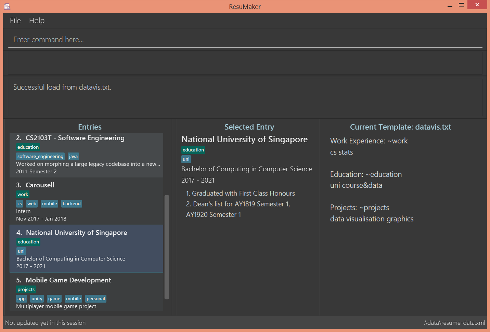

= ResuMaker

ifdef::env-github,env-browser[:relfileprefix: docs/]

https://travis-ci.org/CS2103-AY1819S1-W17-1/main[image:https://travis-ci.org/CS2103-AY1819S1-W17-1/main.svg?branch=master["Build Status", link="https://travis-ci.org/CS2103-AY1819S1-W17-1/main"]]
https://ci.appveyor.com/project/anubh-v/main-6mx97[image:https://ci.appveyor.com/api/projects/status/7ge0ty51hokyqkpy/branch/master?svg=true[Build status]]
https://coveralls.io/github/CS2103-AY1819S1-W17-1/main?branch=master[image:https://coveralls.io/repos/github/CS2103-AY1819S1-W17-1/main/badge.svg?branch=master[Coverage Status]]
https://www.codacy.com/app/anubh-v/main?utm_source=github.com&amp;utm_medium=referral&amp;utm_content=CS2103-AY1819S1-W17-1/main&amp;utm_campaign=Badge_Grade[image:https://api.codacy.com/project/badge/Grade/a03ee3703b9b464da2449893052e8532[Codacy Badge]]

ifdef::env-github[]

endif::[]

ifndef::env-github[]
image::images/Ui.png[width="600"]
endif::[]

* Welcome to ResuMaker - a fast and flexible resume generator! It has a GUI, but most of the user interactions happen using a CLI (Command Line Interface)
* ResuMaker is optimised for computer science professionals, and can help you customise your resumes for specific jobs or requirements.
* Jump to our <<UserGuide#, User Guide>> to get started!

== Site Map

* <<UserGuide#, User Guide>>
* <<DeveloperGuide#, Developer Guide>>
* <<AboutUs#, About Us>>
* <<ContactUs#, Contact Us>>

== Acknowledgements

* Some parts of this application were inspired by the excellent http://code.makery.ch/library/javafx-8-tutorial/[Java FX tutorial] by
_Marco Jakob_.
* Libraries used: https://github.com/TestFX/TestFX[TextFX], https://bitbucket.org/controlsfx/controlsfx/[ControlsFX], https://github.com/FasterXML/jackson[Jackson], https://github.com/google/guava[Guava], https://github.com/junit-team/junit5[JUnit5]
* Adapted from: https://github.com/se-edu/addressbook-level4[An excellent Address Book application] created by the https://se-edu.github.io/[SE-EDU] initiative

== Licence : link:LICENSE[MIT]
